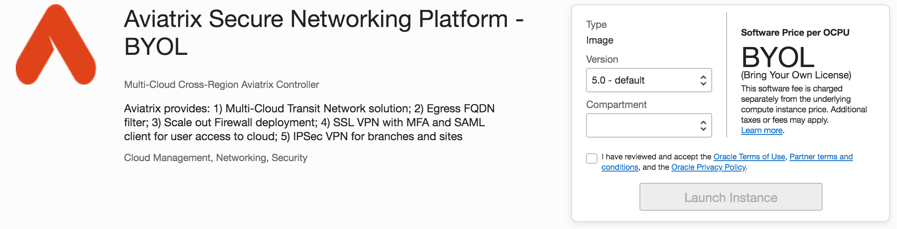
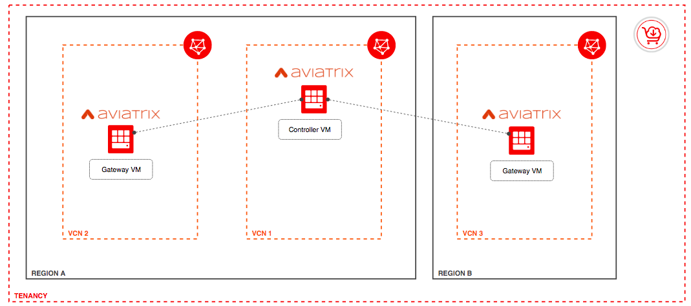
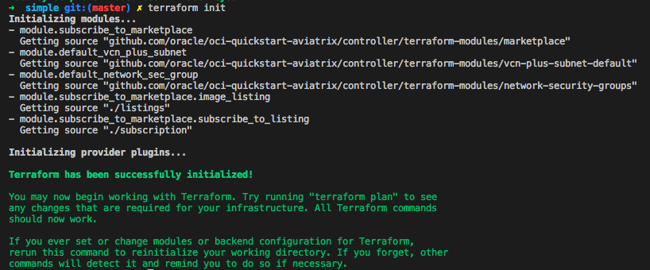
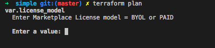
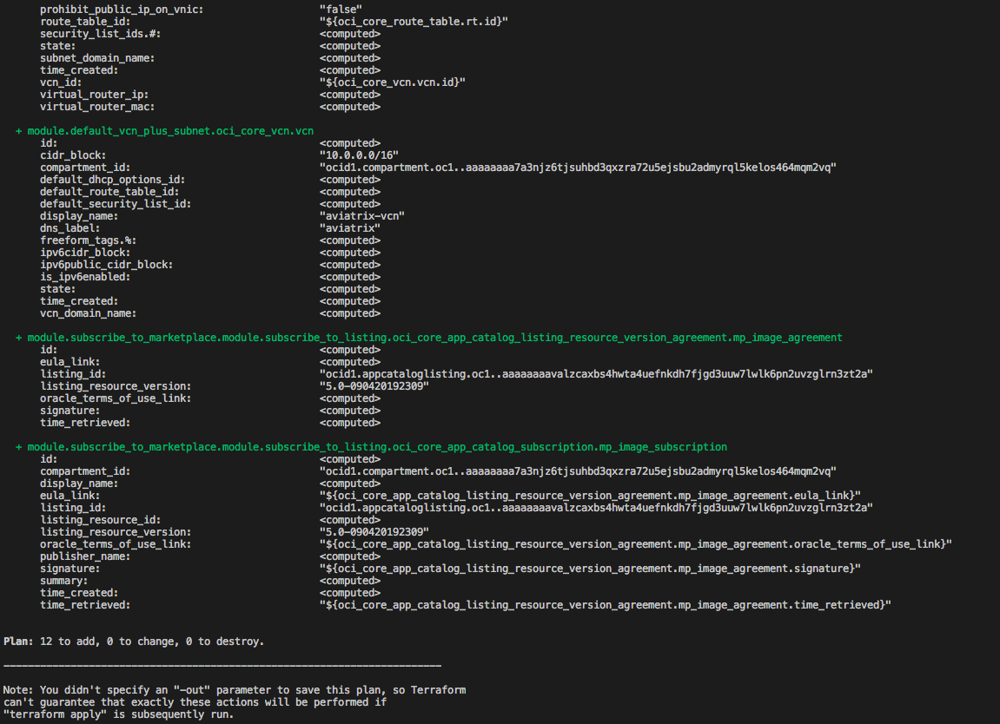
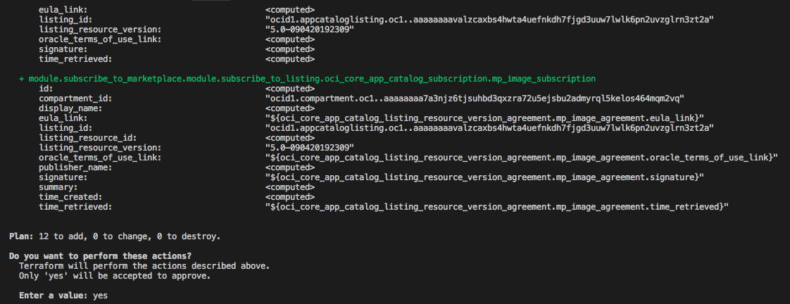
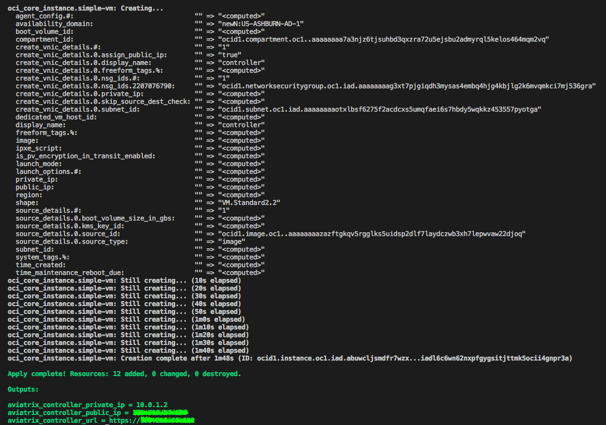

# Aviatrix Controller

These are Terraform modules that deploys [Aviatrix Controller](https://docs.aviatrix.com/StartUpGuides/oracle-aviatrix-cloud-controller-startup-guide.html) on [Oracle Cloud Infrastructure (OCI)](https://cloud.oracle.com/en_US/cloud-infrastructure) from the Oracle Cloud Infrastructure Marketplace.

* [simple](simple) contains Terraform resources for deploying a single node of Aviatrix Controller on Oracle Cloud Infrastructure via Terraform CLI.
* [terraform-modules](terraform-modules) contains reusable Terraform modules

This repo is under active development.  Building open source software is a community effort.  We're excited to engage with the community building this.

## Prerequisites

First off we'll need to do some pre deploy setup.  That's all detailed [here](https://github.com/oracle/oci-quickstart-prerequisites).

Aviatrix Controller is a software packaged as a VM image in the [Oracle Cloud Infrastructure Marketplace](https://docs.cloud.oracle.com/iaas/Content/Marketplace/Concepts/marketoverview.htm). Make sure the user has appropriated Identity [policies](https://docs.cloud.oracle.com/iaas/Content/Marketplace/Concepts/marketoverview.htm#auth) to access and deploy the VM.

Customers can run Aviatrix Controller from local Terraform CLI, OCI Resource Manager Service or directly from the Marketplace Service in the OCI console. The Terraform template will automatically subscribe to the Marketplace Image based on user selection of one of these License modes:

* Customers can Bring Your Own License (BYOL):



* Pay for the software license and Oracle Cloud Infrastructure resource costs consolidated into a single Oracle Cloud Infrastructure bill (subject to availability in some regions):


## Overview

Aviatrix Controller [simple](./simple/) template should provision all necessary [Networking](https://docs.cloud.oracle.com/iaas/Content/Network/Concepts/overview.htm#OverviewofNetworking) Infrastructure resources to enable you to connect via HTTPS to your OCI VM including:

* [VCN](https://docs.cloud.oracle.com/iaas/Content/Network/Concepts/overview.htm#components)
* Public Subnet
* Internet Gateway
* Route Tables
* Security Rules



## Getting Started - Clone the Module

Now, we'll want a local copy of this repo by running:

```git
git clone https://github.com/oracle/oci-quickstart-aviatrix.git
```

## Deploy Simple from Terraform CLI

The TF templates can be initialized by running the following commands:

```bash
cd oci-quickstart-aviatrix/controller/simple
terraform init
```

This gives the following output:



Next, we should modify our template variables accordingly to our OCI Tenancy.
We can use the boilerplate available on [terraform.tfvars.template](./simple/terraform.tfvars.template) to setup the OCI provider variables. Rename the file to `terraform.tfvars` so that Terraform CLI can automatically pick it up as the default variables configuration.

We should also modify [variables.tf](./simple/variables.tf), updating some required variables:

```terraform
# Variables required by the OCI Provider
variable "tenancy_ocid" {}

variable "user_ocid" {}
variable "fingerprint" {}
variable "region" {}
variable "private_key_path" {}
variable "ssh_public_key" {}

# Variables required for launching Aviatrix Controller
variable "compartment_ocid" {
  description = "Compartment where infrastructure resources will be created"
}

variable "license_model" {
  description = "Enter Marketplace License model = BYOL or PAID"
}

variable "product_version" {
  default     = "5.0"
  description = "Aviatrix Controller Version available in the Marketplace"
}

# Standard OCI Variables for Compute and Networking Resources
variable "availability_domain" {
  default     = 1
  description = "OCI Availability Domains: 1,2,3  (subject to region availability)"
}

variable "vm_display_name" {
  default = "controller"
}

variable "vm_compute_shape" {
  default = "VM.Standard2.2" //2 cores
}

variable "vcn_display_name" {
  default = "aviatrix-vcn"
}

variable "vcn_dns_label" {
  default = "aviatrix"
}

variable "vcn_cidr_block" {
  default = "10.0.0.0/16"
}

variable "subnet_display_name" {
  default = "controller"
}

variable "subnet_cidr_block" {
  default = "10.0.1.0/24"
}

variable "subnet_dns_label" {
  default = "controller"
}

variable "nsg_display_name" {
  default = "controller-sec-group"
}

variable "nsg_whitelist_ip" {
  description = "Network Security Groups - Whitelisted CIDR block for ingress communication: Enter 0.0.0.0/0 or <your IP>/32 "
  default     = "0.0.0.0/0"
}

```

Now we should run a plan to make sure everything looks good:

```terraform
terraform plan
```

It will prompt you to choose the License Model: `BYOL` or `PAID`. You can also save the `license_model` variable into `terraform.tfvars`.



After confirming the License model, that gives:



Finally, if everything is good, we can go ahead and apply:

```terraform
terraform apply # will prompt to select license model again and continue the operation
```



The output of `terraform apply` should look like:



We now can connect to the Controller UI via HTTPS through the public IP address of the OCI VM. For additional instructions on how to access the controller, please follow [documentation](https://docs.aviatrix.com/StartUpGuides/oracle-aviatrix-cloud-controller-startup-guide.html).
